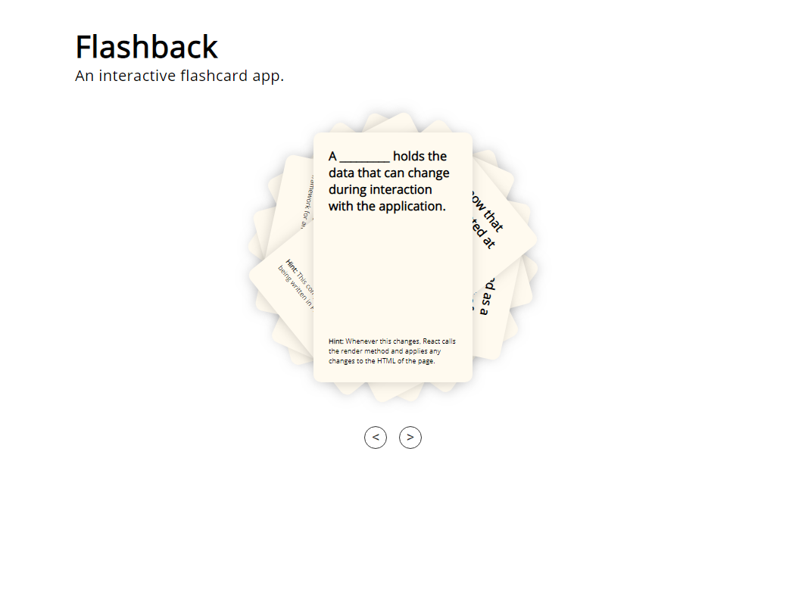

# README

Flashback is an interactive flashcard app written with ReactJS.

See it in action <a href="https://flashback-winnie-khuu.herokuapp.com">here</a>.

## TECHNOLOGIES USED
* HTML
* CSS
* ReactJS

## SEE IT LOCALLY

1. Download the repository and unzip the files.
2. Navigate to the folder `cd XXXXX/Flashback-master`
3. Open the `index.html` file in your preferred browser.

## SCREENSHOTS

Question side of the flashcard

Answer side of the flashcard with picture
